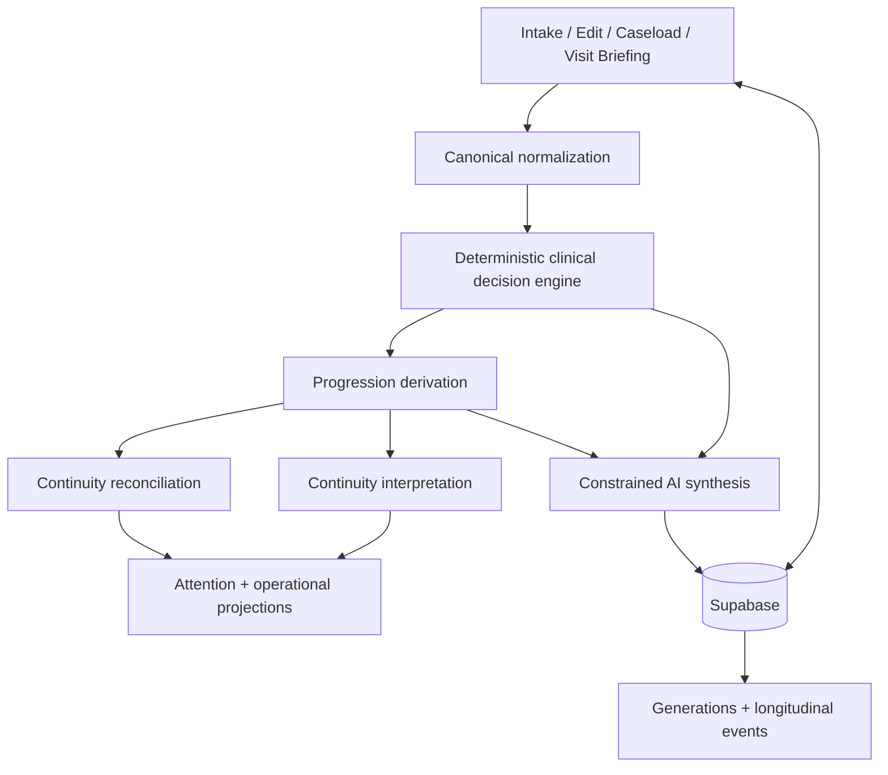

# Clinical Continuity Platform Architecture Reference

## Status and evidence method

This is the comprehensive implementation-oriented companion to the permanent [System Architecture](system-architecture.md). It records repository reality as of this audit, not a new architecture authorization. Statements labeled **Observed** come directly from active documents or source. Statements labeled **Inference** are reasoned conclusions and include confidence.

## Architecture at a glance



The Shared Continuity Foundation is intentionally absent as a runtime node: it is an approved conceptual responsibility layer, not an extracted module.

## Module relationship catalog

### Delivery and composition

| Module area | Responsibilities | Direct dependencies | Principal consumers |
| --- | --- | --- | --- |
| `src/app/new-case/page.tsx` | Structured OT intake, deterministic preview/assembly, plan generation request, case and generation creation. | Clinical input/decision/progression builders, Supabase, `/api/generate-plan`. | Clinician evaluation workflow. |
| `src/app/cases/[id]/edit/page.tsx` | Loads and edits structured live case data; updates case and creates historical generation records in mutation flows. | Supabase, router; local payload assembly. | Clinician correction/edit workflow. |
| `src/app/cases/[id]/CaseWorkspaceClient.tsx` | Patient composition root: data loading, mutations, progression checks, regeneration, deterministic projections, historical review, Visit Briefing rendering. | Supabase, most projection/reasoning builders, API routes, child components. | `/cases/[id]`, `/cases/[id]/reference`. |
| `src/app/cases/page.tsx` | Reads cases/latest events and derives caseload views. | Supabase, `patientCaseload`, `PatientEntryCard`. | Patient list workflow. |
| `src/app/api/generate-plan/route.ts` | Constrains OpenAI to one structured operational-prioritization synthesis; appends deterministic continuity interpretation. | OpenAI, `buildContinuityInterpretation`. | Intake/workspace generation. |
| `src/app/api/generate-detail-module/route.ts` | Generates scoped caregiver/equipment/ADL/transfer detail artifacts without creating a new plan. | OpenAI. | Workspace detail actions. |
| `src/app/api/progression-check/route.ts` | Transaction-like orchestration of baseline, event, current state, attention, optional operational refresh, and persistence. | Longitudinal helpers, Supabase. | Workspace progression workflow. |

### Deterministic engine

| Module | Input → output | Architectural ownership |
| --- | --- | --- |
| `buildClinicalDecisionInput.ts` | heterogeneous case payload → normalized `ClinicalDecisionInput` | Delivery-to-clinical boundary normalization. |
| `clinicalDecisionEngine.ts` | goal/barriers/risk/support/lenses/environment → scored selected strategies and reasoning | Authoritative deterministic clinical reasoning. |
| `buildCanonicalCasePayload.ts` | live case → case plus normalized input/model/focus | Common reasoning assembly seam. |
| `buildProgressionState.ts` | canonical case → `ProgressionState` | OT progression interpretation. |
| `buildCanonicalContinuityState.ts` | case/stale/follow-up → canonical payload, progression, continuity interpretation, assembly state | Intended continuity composition seam; not used uniformly. |
| `buildContinuityInterpretation.ts` | progression/prioritization/decision/stale/follow-up → continuity condition, drift, alerts, pressure | Deterministic continuity interpretation. |

### Reconciliation and projection

| Module group | Responsibility and dependency direction |
| --- | --- |
| `progression/buildProgressionReadiness.ts` | Converts phase/readiness/risk evidence into downstream readiness. |
| `continuity/reconcileBarriers.ts` | Reconciles active, monitored, and resolved barrier status from current evidence/readiness. |
| `continuity/reconcileActivityConstraint.ts` | Reconciles whether a barrier still constrains a specific target activity; consumes barrier reconciliation/readiness. |
| `continuity/reconcileReassessmentTriggers.ts` | Reconciles trigger relevance; consumes readiness/current evidence. |
| `commandCenterNextAction.ts` | Composes reconciliations and readiness into deterministic next actions; does not own underlying relevance decisions. |
| `currentFocusProgressionAwareness.ts` | Produces progression-aware operational focus from current case, generated output, and reconciled evidence. |
| `buildConclusionEvidence.ts` | Connects current conclusions to supporting clinical evidence. |
| `buildConclusionChangeExplanation.ts` | Explains why maintained conclusions changed. |
| `buildConstraintProgressionNarrative.ts` | Describes constraint evolution without changing authority. |
| `buildProgressEvidence.ts` | Selects evidence of occupational-performance movement. |
| `buildReassessmentSummary.ts` | Combines change explanation, constraint narrative, and progress evidence into reassessment orientation. |
| `buildSessionFocus.ts` | Compresses current evidence/constraints into session-level orientation. |
| `clinicalDelta/buildClinicalImpactSummary.ts` | Compares prior/current workspace snapshots and reported changes. |
| `clinicalDisplayLanguage.ts`, `clinicalDisplayHeadline.ts` | Presentation compression only. |

## Dependency graph and order constraints

```text
case source fields
  └─ normalization
       └─ clinical decision model
            ├─ AI synthesis context
            └─ canonical case
                 └─ progression state
                      ├─ progression readiness
                      │    └─ barrier / activity / trigger reconciliation
                      │         └─ current focus and next actions
                      ├─ continuity interpretation
                      └─ attention / evidence / summaries
```

**Invariant:** reverse dependencies are unsafe. AI output may inform presentation and carry operational prioritization, but it must not become the source from which the deterministic clinical model is inferred.

## Interface map

### Architecture-facing TypeScript interfaces

- `ClinicalDecisionInput` and `ClinicalDecisionModel` in `clinicalDecisionEngine.ts` define the normalized reasoning contract.
- `ProgressionState`, `ProgressionPhase`, and `AdvancementReadiness` in `progression/progressionTypes.ts` define derived progression state.
- `ProgressionCheckInput`, `LongitudinalEvent`, `CurrentLongitudinalState`, `ClinicalAttentionState`, and `OperationalPrioritization` in `longitudinal/longitudinalTypes.ts` define the longitudinal command/projection boundary.
- Reconciliation modules export typed input/result objects to distinguish evidence intake from relevance outcomes.
- Evidence/explanation/summary builders export UI-consumable domain objects; these are internal projections rather than persistence authorities.

### HTTP interface map

| Method/path | Request purpose | Response/side effects | Authority note |
| --- | --- | --- | --- |
| `POST /api/generate-plan` | Provide deterministic model, progression, case context, and freshness state. | OpenAI structured plan plus deterministic continuity interpretation. | AI output is synthesis, not reasoning authority. |
| `POST /api/generate-detail-module` | Request one scoped detail artifact. | Type-specific structured JSON. | Must remain subordinate to the existing plan/model. |
| `POST /api/progression-check` | Submit focused functional/barrier/status/direction change. | Event, current state, attention, generated output, validation flags; persists event/case changes. | Deterministic mutation path. |
| `GET/POST /api/dev/seed-test-cases` | Preview/create synthetic cases. | Supabase seed mutations. | Development support, not validation evidence. |
| `GET/POST /api/seed-progression-checks` | Inspect/create synthetic progression events. | Supabase seed mutations. | Development support. |
| `GET /api/test-openai` | Provider connectivity check. | Provider response/error. | Delivery diagnostic only. |

No authentication/authorization layer is visible in `src/`; Supabase policy configuration is also not present. This is an **observation of repository scope**, not evidence that deployed access is unrestricted.

## Persistence interface and state ownership

### Observed tables

| Table | Observed role | Mutation model |
| --- | --- | --- |
| `cases` | Live structured case, generated output, baseline, current longitudinal and attention projections, stale state. | Insert/update/delete by browser and server flows. Live current truth. |
| `generations` | Time-bound prompt/input/output snapshots. | Inserted on generation/regeneration; historical rows can be deleted from workspace UI. Architecturally snapshots are immutable in content. |
| `longitudinal_events` | Append-style progression events with prior/current/attention/emphasis snapshots. | Inserted by progression API; read in caseload/workspace. Historical truth. |

**Uncertainty:** no migrations, SQL schema, generated database types, row-level-security policies, indexes, foreign keys, or transaction definitions were found in the repository. Column optionality, database-enforced immutability, and deployment security cannot be validated here.

### State ownership matrix

| State | Owner | Stored/derived | Update trigger |
| --- | --- | --- | --- |
| Structured patient/function/environment/goals/caregiver data | Live case + clinician input | Stored on `cases` | Evaluation, edit, correction. |
| Clinical decision model | Deterministic engine | Recomputed and sometimes persisted/snapshotted | Structured evidence change. |
| Progression state | Deterministic progression logic | Recomputed and included in generated/current payloads | Evaluation or relevant mutation. |
| Original baseline | Evaluation/current case persistence contract | Stored, write-once intention | First progression check if absent. |
| Current longitudinal state | Longitudinal projection | Stored on `cases` | Progression event. |
| Clinical attention state | Deterministic attention builder | Stored on `cases` | Progression event. |
| Operational prioritization | Clinical Continuity projection; AI synthesis or deterministic event refresh carries representation | Stored within generated output | Generation or confirmed treatment-direction change. |
| Continuity interpretation | Deterministic continuity builder | Derived/attached to plan; assembly available | Generation/assembly. |
| Generated plan/detail | AI synthesis under deterministic constraint | Stored on case/generation payloads | Explicit generation. |
| Historical generation/event | Persistence history | Stored separately | Generation or progression check. |

## Lifecycle reference

### Case lifecycle

1. **Create:** structured intake → normalize → decide → progress → generate → persist case/generation.
2. **Orient:** load live case/history → recompute projections → render Visit Briefing.
3. **Progress:** focused check → append event → advance current projection/attention → optionally refresh emphasis.
4. **Mutate/correct:** update live case → recompute/regenerate or mark consequences according to mutation path → preserve earlier snapshots.
5. **Review history:** select a generation/event snapshot without granting it current authority.
6. **Delete:** UI can delete cases and individual generation records; database cascade/retention behavior is not visible.

### Maintained-conclusion lifecycle

```text
supported current conclusion
  → new evidence
  → reconcile
      ├─ remains current
      ├─ monitor
      ├─ resolved
      ├─ superseded/replaced
      └─ requires correction/review
  → refresh dependent present projections
  → retain historical conclusion and evidence context
```

The neutral lifecycle is conceptually approved; the concrete barrier/activity/trigger rules remain Clinical Continuity/OT-owned.

## Extension point reference

| Need | Appropriate seam | Preconditions |
| --- | --- | --- |
| Accept an approved new case field | Normalization plus intake/edit/persistence contracts | Product/clinical/schema scope; continuity-mutation analysis. |
| Change clinical decision rules | `clinicalDecisionEngine.ts` | Clinical validation, Architecture approval, deterministic tests. |
| Change OT progression meaning | `buildProgressionState.ts` / progression helpers | OT evidence and explicit scope; preserve authority distinctions. |
| Add relevance rule | Specific reconciliation module | Current evidence source, contradiction rules, history preservation, tests. |
| Add a current projection | Narrow pure `build*` module composed downstream | Must not create a competing truth source. |
| Add longitudinal event kind | Longitudinal types/build/update/API persistence | Baseline/current/history/attention consequences fully specified. |
| Change synthesis provider | Generation-route adapter | Equivalent structured contract, security, deterministic authority. |
| Add application/discipline | None currently authorized | Cross-application validation and Founder/Architecture approval first. |

## Architectural evidence index

- Product identity and invariants: [Platform Foundation](../foundation/platform-foundation.md).
- Ownership and permanent contracts: [System Architecture](system-architecture.md).
- Current capability/validation truth: [Program State](../governance/program-state.md).
- Deterministic authority, mutation, history, progression/emphasis, and transitional decisions: [Decision Continuity Log](../governance/decision-continuity-log.md).
- Conceptual neutral obligations: [Shared Continuity Foundation](../foundation/shared-continuity-foundation.md).
- Concrete reconciliation rationale: [Continuity Reconciliation](references/continuity_reconciliation_architecture.md) and [Activity Constraint Reconciliation](references/activity_constraint_reconciliation_architecture.md).
- Runtime proof: module and route locations in the tables above; tests under `tests/` and colocated `.test.mjs` files.

## Audit conclusions

### Observed

- The functional dependency order is consistent with deterministic authority.
- Current/history separation is explicit in the progression API and governance.
- Application composition and persistence access are much less modular than the pure reasoning functions.
- Architecture contracts are spread across active authorities, subordinate references, and source rather than one implementation reference; this document closes that discovery gap.

### Inference

- **High confidence:** pure builders are the most stable integration seam because they are provider-free and testable.
- **Medium confidence:** current persistence operations may not be atomic across event insert and case update because no transaction/RPC is visible; database behavior outside Git could alter this assessment.
- **High confidence:** uniform canonical continuity assembly is incomplete because `buildCanonicalContinuityState` has limited call evidence while flows assemble similar state independently.
